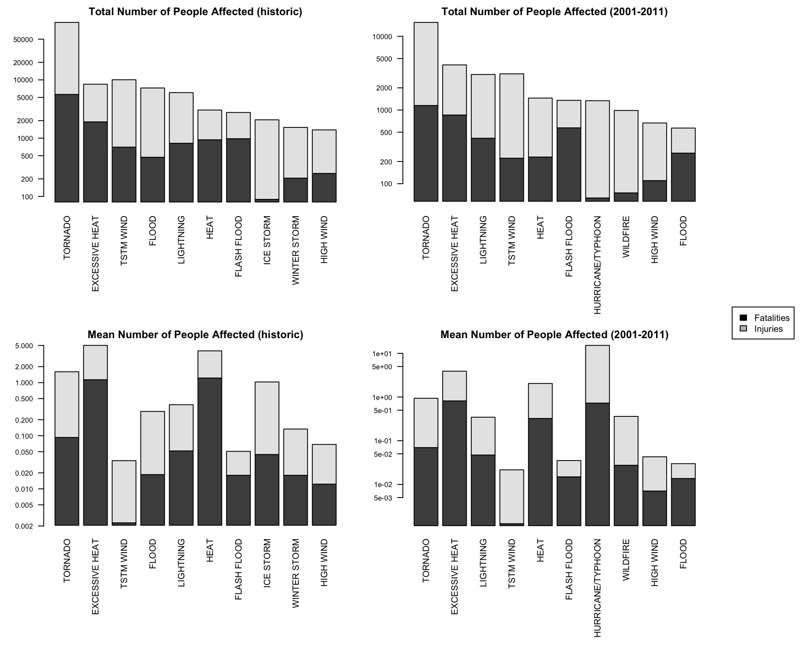
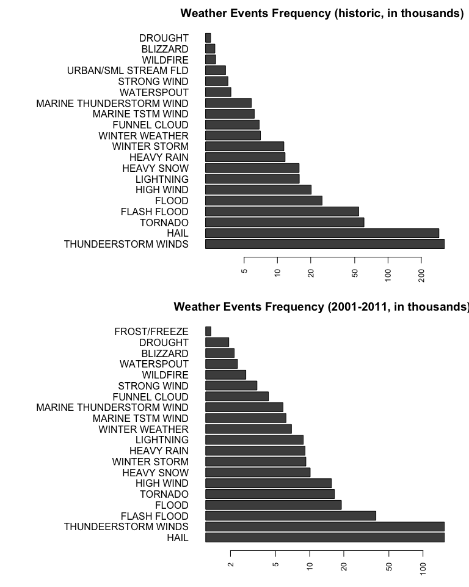
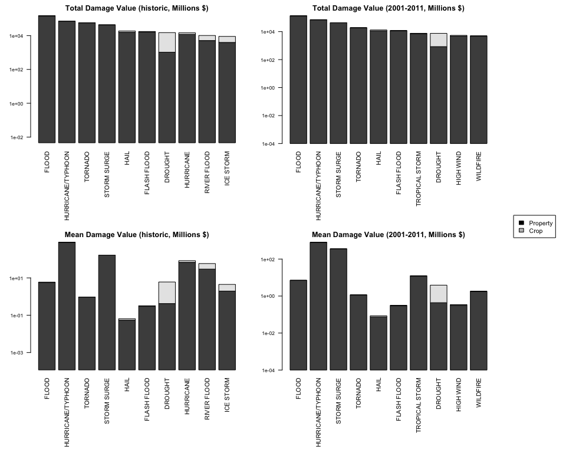

# Reproducible Research: Course Project 2
Alicia Rodriguez  
3/19/2017  


# Health and Economic Consequences of Weather Events between 1950 and 2011

## Synopsis

This documents provides an analysis of the impact on public health and on economy across the United States, in the time span 1950-2011. The impact on public healt will be measured as the number of deaths, the number of people injured, and the combination of both during each weather event considered. The economic impact will be measured as the value in $ of the properties damages, the value in $ of crop damages, and the combination of both caused by the weather events considered. The impact will be considered along the whole time span (1950-2011) and along a narrower time span of the last 10 years (2001-2011). The goal is for the responsibles for prioritizing resources for each severe weather event to evaluate if they want to reduce any of the variables (deaths, injuries, property damage, or crop damage) isolated, or considering any combination of them. Useful information as the frequency and implicit damage of each severe event is also provided to complete the context of the study.

## Downloading, Reading and Processing the Raw Data

First, let's download the data and load the content using the option as.is in order to load the contents with no transformations:

```r
  download.file("https://d396qusza40orc.cloudfront.net/repdata%2Fdata%2FStormData.csv.bz2", 
                destfile="./original_data.csv.bz2", method="curl")
```

```r
  original_data<-read.csv("./original_data.csv.bz2", as.is=T)
```

Let's take a look at the first rows, as well as the structure:

```r
  head(original_data)
```

```
##   STATE__           BGN_DATE BGN_TIME TIME_ZONE COUNTY COUNTYNAME STATE
## 1       1  4/18/1950 0:00:00     0130       CST     97     MOBILE    AL
## 2       1  4/18/1950 0:00:00     0145       CST      3    BALDWIN    AL
## 3       1  2/20/1951 0:00:00     1600       CST     57    FAYETTE    AL
## 4       1   6/8/1951 0:00:00     0900       CST     89    MADISON    AL
## 5       1 11/15/1951 0:00:00     1500       CST     43    CULLMAN    AL
## 6       1 11/15/1951 0:00:00     2000       CST     77 LAUDERDALE    AL
##    EVTYPE BGN_RANGE BGN_AZI BGN_LOCATI END_DATE END_TIME COUNTY_END
## 1 TORNADO         0                                               0
## 2 TORNADO         0                                               0
## 3 TORNADO         0                                               0
## 4 TORNADO         0                                               0
## 5 TORNADO         0                                               0
## 6 TORNADO         0                                               0
##   COUNTYENDN END_RANGE END_AZI END_LOCATI LENGTH WIDTH F MAG FATALITIES
## 1         NA         0                      14.0   100 3   0          0
## 2         NA         0                       2.0   150 2   0          0
## 3         NA         0                       0.1   123 2   0          0
## 4         NA         0                       0.0   100 2   0          0
## 5         NA         0                       0.0   150 2   0          0
## 6         NA         0                       1.5   177 2   0          0
##   INJURIES PROPDMG PROPDMGEXP CROPDMG CROPDMGEXP WFO STATEOFFIC ZONENAMES
## 1       15    25.0          K       0                                    
## 2        0     2.5          K       0                                    
## 3        2    25.0          K       0                                    
## 4        2     2.5          K       0                                    
## 5        2     2.5          K       0                                    
## 6        6     2.5          K       0                                    
##   LATITUDE LONGITUDE LATITUDE_E LONGITUDE_ REMARKS REFNUM
## 1     3040      8812       3051       8806              1
## 2     3042      8755          0          0              2
## 3     3340      8742          0          0              3
## 4     3458      8626          0          0              4
## 5     3412      8642          0          0              5
## 6     3450      8748          0          0              6
```

```r
  str(original_data)
```

```
## 'data.frame':	902297 obs. of  37 variables:
##  $ STATE__   : num  1 1 1 1 1 1 1 1 1 1 ...
##  $ BGN_DATE  : chr  "4/18/1950 0:00:00" "4/18/1950 0:00:00" "2/20/1951 0:00:00" "6/8/1951 0:00:00" ...
##  $ BGN_TIME  : chr  "0130" "0145" "1600" "0900" ...
##  $ TIME_ZONE : chr  "CST" "CST" "CST" "CST" ...
##  $ COUNTY    : num  97 3 57 89 43 77 9 123 125 57 ...
##  $ COUNTYNAME: chr  "MOBILE" "BALDWIN" "FAYETTE" "MADISON" ...
##  $ STATE     : chr  "AL" "AL" "AL" "AL" ...
##  $ EVTYPE    : chr  "TORNADO" "TORNADO" "TORNADO" "TORNADO" ...
##  $ BGN_RANGE : num  0 0 0 0 0 0 0 0 0 0 ...
##  $ BGN_AZI   : chr  "" "" "" "" ...
##  $ BGN_LOCATI: chr  "" "" "" "" ...
##  $ END_DATE  : chr  "" "" "" "" ...
##  $ END_TIME  : chr  "" "" "" "" ...
##  $ COUNTY_END: num  0 0 0 0 0 0 0 0 0 0 ...
##  $ COUNTYENDN: logi  NA NA NA NA NA NA ...
##  $ END_RANGE : num  0 0 0 0 0 0 0 0 0 0 ...
##  $ END_AZI   : chr  "" "" "" "" ...
##  $ END_LOCATI: chr  "" "" "" "" ...
##  $ LENGTH    : num  14 2 0.1 0 0 1.5 1.5 0 3.3 2.3 ...
##  $ WIDTH     : num  100 150 123 100 150 177 33 33 100 100 ...
##  $ F         : int  3 2 2 2 2 2 2 1 3 3 ...
##  $ MAG       : num  0 0 0 0 0 0 0 0 0 0 ...
##  $ FATALITIES: num  0 0 0 0 0 0 0 0 1 0 ...
##  $ INJURIES  : num  15 0 2 2 2 6 1 0 14 0 ...
##  $ PROPDMG   : num  25 2.5 25 2.5 2.5 2.5 2.5 2.5 25 25 ...
##  $ PROPDMGEXP: chr  "K" "K" "K" "K" ...
##  $ CROPDMG   : num  0 0 0 0 0 0 0 0 0 0 ...
##  $ CROPDMGEXP: chr  "" "" "" "" ...
##  $ WFO       : chr  "" "" "" "" ...
##  $ STATEOFFIC: chr  "" "" "" "" ...
##  $ ZONENAMES : chr  "" "" "" "" ...
##  $ LATITUDE  : num  3040 3042 3340 3458 3412 ...
##  $ LONGITUDE : num  8812 8755 8742 8626 8642 ...
##  $ LATITUDE_E: num  3051 0 0 0 0 ...
##  $ LONGITUDE_: num  8806 0 0 0 0 ...
##  $ REMARKS   : chr  "" "" "" "" ...
##  $ REFNUM    : num  1 2 3 4 5 6 7 8 9 10 ...
```

A first inspection sugests some transformations that could be useful, mainly related to factors in the event type.

```r
  original_data$EVTYPE<-factor(original_data$EVTYPE)
```

Regarding the columns representing the damages (property and crop), they need to be transformed so that they hold their whole value (base value and modifying exponen like Millions, Billions...). Before transforming the alphabetical characters used to signify magnitude for property and crop damages, let's take a look at the values they may take:


```r
unique(original_data$PROPDMGEXP)
```

```
##  [1] "K" "M" ""  "B" "m" "+" "0" "5" "6" "?" "4" "2" "3" "h" "7" "H" "-"
## [18] "1" "8"
```

```r
unique(original_data$CROPDMGEXP)
```

```
## [1] ""  "M" "K" "m" "B" "?" "0" "k" "2"
```

We see that there are more symbols besides the "K", "M", and "B" specified in the documentation. We will treat lowercase "k" and "m" as the uppercase cases. We will also consider that h and H are for hundreds. For the numerical symbols, let's take a look if the numbers could be the exponents (e.g., 2 corresponds to 10+E02, i.e., hundreds). 


```r
tail(cbind(original_data$CROPDMG[grep("[0-9]",original_data$CROPDMGEXP)],
      as.numeric(original_data$CROPDMGEXP[grep("[0-9]",original_data$CROPDMGEXP)])),n=10)
```

```
##       [,1] [,2]
## [11,]    5    0
## [12,]   50    0
## [13,]    5    0
## [14,]    5    0
## [15,]    5    0
## [16,]    0    2
## [17,]    0    0
## [18,]    0    0
## [19,]    0    0
## [20,]    0    0
```

```r
head(cbind(original_data$PROPDMG[grep("[0-9]",original_data$PROPDMGEXP)],
      as.numeric(original_data$PROPDMGEXP[grep("[0-9]",original_data$PROPDMGEXP)])),n=10)
```

```
##        [,1] [,2]
##  [1,] 150.0    0
##  [2,]  50.0    0
##  [3,]   5.0    0
##  [4,]  37.0    0
##  [5,]   0.0    0
##  [6,]   0.5    0
##  [7,]   0.5    0
##  [8,]   0.0    5
##  [9,]   0.0    0
## [10,]   1.0    0
```

We see that for some values in the first column which are zero, the second column values are different from zero, which makes no sense with the hypothesis of the second column being exponents. Therefore, we discard the hypothesis of the numbers in the columns EXP being exponents and leave the base values unmodified (i.e., as the value in PROPDMG and CROPDMG).

For the rest, since there is no information in the documentation, we will leave them as the value in PROPDMG and CROPDMG. Since there is no info on how billions should be interpreted, the transformation will be to multiply by 1,000,000,000.


```r
original_data$PROPDMGFULL<-original_data$PROPDMG
original_data$PROPDMGFULL[original_data$PROPDMGEXP=="H"]<-original_data$PROPDMG[original_data$PROPDMGEXP=="H"]*100
original_data$PROPDMGFULL[original_data$PROPDMGEXP=="h"]<-original_data$PROPDMG[original_data$PROPDMGEXP=="h"]*100
original_data$PROPDMGFULL[original_data$PROPDMGEXP=="K"]<-original_data$PROPDMG[original_data$PROPDMGEXP=="K"]*1000
original_data$PROPDMGFULL[original_data$PROPDMGEXP=="k"]<-original_data$PROPDMG[original_data$PROPDMGEXP=="k"]*1000
original_data$PROPDMGFULL[original_data$PROPDMGEXP=="M"]<-original_data$PROPDMG[original_data$PROPDMGEXP=="M"]*1000000
original_data$PROPDMGFULL[original_data$PROPDMGEXP=="m"]<-original_data$PROPDMG[original_data$PROPDMGEXP=="m"]*1000000
original_data$PROPDMGFULL[original_data$PROPDMGEXP=="B"]<-original_data$PROPDMG[original_data$PROPDMGEXP=="B"]*1000000000
original_data$PROPDMGFULL[original_data$PROPDMGEXP=="b"]<-original_data$PROPDMG[original_data$PROPDMGEXP=="b"]*1000000000

original_data$CROPDMGFULL<-original_data$CROPDMG
original_data$CROPDMGFULL[original_data$CROPDMGEXP=="h"]<-original_data$CROPDMG[original_data$CROPDMGEXP=="h"]*100
original_data$CROPDMGFULL[original_data$CROPDMGEXP=="H"]<-original_data$CROPDMG[original_data$CROPDMGEXP=="H"]*100
original_data$CROPDMGFULL[original_data$CROPDMGEXP=="K"]<-original_data$CROPDMG[original_data$CROPDMGEXP=="K"]*1000
original_data$CROPDMGFULL[original_data$CROPDMGEXP=="k"]<-original_data$CROPDMG[original_data$CROPDMGEXP=="k"]*1000
original_data$CROPDMGFULL[original_data$CROPDMGEXP=="M"]<-original_data$CROPDMG[original_data$CROPDMGEXP=="M"]*1000000
original_data$CROPDMGFULL[original_data$CROPDMGEXP=="m"]<-original_data$CROPDMG[original_data$CROPDMGEXP=="m"]*1000000
original_data$CROPDMGFULL[original_data$CROPDMGEXP=="b"]<-original_data$CROPDMG[original_data$CROPDMGEXP=="b"]*1000000000
original_data$CROPDMGFULL[original_data$CROPDMGEXP=="B"]<-original_data$CROPDMG[original_data$CROPDMGEXP=="B"]*1000000000
```

Since no operations with dates are being considered, and the analysis will be across United States (not centered in each state), the rest of the fields are left unmodified.

## Exploring the Impact on Public Health

For inspecting the impact of weather events on public health, the analysis will be focused on fatalities and injuries. Both the cumulative amount of each attribute and the mean value will be analyzed. This way, we can have an intuition on the weather events which cause a high impact because of their severeness and those wich cause a high impact because of their frequency.

```r
total_fatalities<-aggregate(x = original_data$FATALITIES, by=list(original_data$EVTYPE), FUN=sum)
total_injuries<-aggregate(x = original_data$INJURIES, by=list(original_data$EVTYPE), FUN=sum)
mean_fatalities<-aggregate(x = original_data$FATALITIES, by=list(original_data$EVTYPE), FUN=mean)
mean_injuries<-aggregate(x = original_data$INJURIES, by=list(original_data$EVTYPE), FUN=mean)

names(total_fatalities)<-c("EVTYPE","TOTAL_FATALITIES")
names(total_injuries)<-c("EVTYPE","TOTAL_INJURIES")
names(mean_fatalities)<-c("EVTYPE","MEAN_FATALITIES")
names(mean_injuries)<-c("EVTYPE","MEAN_INJURIES")

publicHealth<-merge(total_fatalities,total_injuries,by = "EVTYPE")
publicHealth<-merge(publicHealth, mean_fatalities,by = "EVTYPE")
publicHealth<-merge(publicHealth,mean_injuries,by = "EVTYPE")

publicHealth$TOTAL<-publicHealth$TOTAL_FATALITIES+publicHealth$TOTAL_INJURIES
publicHealth$MEAN<-publicHealth$MEAN_FATALITIES+publicHealth$MEAN_INJURIES
publicHealth<-publicHealth[order(publicHealth$TOTAL,decreasing = T),]
```

Let's have a look at the 10 first rows of data frame created with the publich health impact data, i.e., at the weather events with the highest impact and, thus, those we will focus on.

```r
head(publicHealth,n=10)
```

```
##                EVTYPE TOTAL_FATALITIES TOTAL_INJURIES MEAN_FATALITIES
## 826           TORNADO             5633          91346     0.092874101
## 124    EXCESSIVE HEAT             1903           6525     1.134088200
## 846         TSTM WIND              504           6957     0.002291534
## 167             FLOOD              470           6789     0.018558004
## 453         LIGHTNING              816           5230     0.051796369
## 271              HEAT              937           2100     1.221642764
## 151       FLASH FLOOD              978           1777     0.018018682
## 422         ICE STORM               89           1975     0.044366899
## 753 THUNDERSTORM WIND              133           1488     0.001610891
## 962      WINTER STORM              206           1321     0.018018018
##     MEAN_INJURIES TOTAL       MEAN
## 826    1.50606740 96979 1.59894150
## 124    3.88855781  8428 5.02264601
## 846    0.03163135  7461 0.03392289
## 167    0.26806444  7259 0.28662244
## 453    0.33197918  6046 0.38377555
## 271    2.73794003  3037 3.95958279
## 151    0.03273947  2755 0.05075815
## 422    0.98454636  2064 1.02891326
## 753    0.01802260  1621 0.01963349
## 962    0.11554273  1527 0.13356075
```

We can observe that there are at least two events, THUNDERSTORM WIND and TSTM WIND, which represent the same weather event, but are labeled with different names. Let's see if there are more cases similar to this one with thunderstorm winds (with no other weather event in its name) and tornados, which also seem to suffer a similar problem, and are the leading wheather events.

```r
publicHealth[grep("^(\\btorn\\w+)",publicHealth[,"EVTYPE"],ignore.case = T),]
```

```
##                         EVTYPE TOTAL_FATALITIES TOTAL_INJURIES
## 826                    TORNADO             5633          91346
## 834 TORNADOES, TSTM WIND, HAIL               25              0
## 830                 TORNADO F2                0             16
## 831                 TORNADO F3                0              2
## 827             TORNADO DEBRIS                0              0
## 828                 TORNADO F0                0              0
## 829                 TORNADO F1                0              0
## 832         TORNADO/WATERSPOUT                0              0
## 833                  TORNADOES                0              0
## 835                   TORNADOS                0              0
## 836                    TORNDAO                0              0
##     MEAN_FATALITIES MEAN_INJURIES TOTAL      MEAN
## 826       0.0928741      1.506067 96979  1.598942
## 834      25.0000000      0.000000    25 25.000000
## 830       0.0000000      5.333333    16  5.333333
## 831       0.0000000      1.000000     2  1.000000
## 827       0.0000000      0.000000     0  0.000000
## 828       0.0000000      0.000000     0  0.000000
## 829       0.0000000      0.000000     0  0.000000
## 832       0.0000000      0.000000     0  0.000000
## 833       0.0000000      0.000000     0  0.000000
## 835       0.0000000      0.000000     0  0.000000
## 836       0.0000000      0.000000     0  0.000000
```

```r
publicHealth[grep("^((\\bthun\\w+)|(\\btstm))( )(wind|winds)$",publicHealth[,"EVTYPE"],ignore.case = T),]
```

```
##                  EVTYPE TOTAL_FATALITIES TOTAL_INJURIES MEAN_FATALITIES
## 846           TSTM WIND              504           6957     0.002291534
## 753   THUNDERSTORM WIND              133           1488     0.001610891
## 779  THUNDERSTORM WINDS               64            908     0.003070575
## 813 THUNDERSTORMS WINDS                0              1     0.000000000
## 820   THUNDERTORM WINDS                1              0     0.333333333
## 744 THUNDEERSTORM WINDS                0              0     0.000000000
## 745 THUNDERESTORM WINDS                0              0     0.000000000
## 812  THUNDERSTORMS WIND                0              0     0.000000000
## 816 THUNDERSTORMW WINDS                0              0     0.000000000
## 818   THUNDERSTROM WIND                0              0     0.000000000
## 819  THUNDERSTROM WINDS                0              0     0.000000000
## 821   THUNDERTSORM WIND                0              0     0.000000000
## 822   THUNDESTORM WINDS                0              0     0.000000000
## 823   THUNERSTORM WINDS                0              0     0.000000000
## 864          TSTM WINDS                0              0     0.000000000
## 872   Thunderstorm Wind                0              0     0.000000000
## 875           Tstm Wind                0              0     0.000000000
##     MEAN_INJURIES TOTAL       MEAN
## 846    0.03163135  7461 0.03392289
## 753    0.01802260  1621 0.01963349
## 779    0.04356379   972 0.04663436
## 813    0.07142857     1 0.07142857
## 820    0.00000000     1 0.33333333
## 744    0.00000000     0 0.00000000
## 745    0.00000000     0 0.00000000
## 812    0.00000000     0 0.00000000
## 816    0.00000000     0 0.00000000
## 818    0.00000000     0 0.00000000
## 819    0.00000000     0 0.00000000
## 821    0.00000000     0 0.00000000
## 822    0.00000000     0 0.00000000
## 823    0.00000000     0 0.00000000
## 864    0.00000000     0 0.00000000
## 872    0.00000000     0 0.00000000
## 875    0.00000000     0 0.00000000
```

We see that the tornado case is not critical, as the other occurrences do not accumulate enough fatalities or injuries as to greatly modify the results. However, there are many occurrences of thunderstorm wind events. Therefore, let's merge all of them.

```r
thunderstormRows<-grep("^((\\bthun\\w+)|(\\btstm))( )(wind|winds)$",
                       publicHealth[,"EVTYPE"],
                       ignore.case = T)
publicHealth$TOTAL_FATALITIES[thunderstormRows[1]]<-sum(publicHealth$TOTAL_FATALITIES[thunderstormRows])
publicHealth$TOTAL_INJURIES[thunderstormRows[1]]<-sum(publicHealth$TOTAL_INJURIES[thunderstormRows])
publicHealth$TOTAL[thunderstormRows[1]]<-sum(publicHealth$TOTAL[thunderstormRows])
publicHealth<-publicHealth[-thunderstormRows[2:length(thunderstormRows)],]
```

If we check now the thunderstorm wind occurrences, we have the following:

```r
publicHealth[grep("^((\\bthun\\w+)|(\\btstm))( )(wind|winds)$", publicHealth[,"EVTYPE"], ignore.case = TRUE),]
```

```
##        EVTYPE TOTAL_FATALITIES TOTAL_INJURIES MEAN_FATALITIES
## 846 TSTM WIND              702           9354     0.002291534
##     MEAN_INJURIES TOTAL       MEAN
## 846    0.03163135 10056 0.03392289
```

Since the data available is from back 1950, and it can be seen that the data collected at that old dates are quite different (less detailed) than the current one, let's make a narrower analysis ranging the last 10 years of the dataset (2001-2011). We are going to make the same transformations as with the whole data set, explained above.

```r
#Select data ranging from 2001-2011
lasttenyears_data<-original_data[as.Date(original_data$BGN_DATE, "%m/%d/%Y %H:%M:%S")>as.Date("2001-01-01"),]

#Aggregate fatalities and injuries (total and mean)
total_fatalities_lasttenyears<-aggregate(x = lasttenyears_data$FATALITIES,
                                   by=list(lasttenyears_data$EVTYPE), FUN=sum)
mean_fatalities_lasttenyears<-aggregate(x = lasttenyears_data$FATALITIES,
                                   by=list(lasttenyears_data$EVTYPE), FUN=mean)
total_injuries_lasttenyears<-aggregate(x = lasttenyears_data$INJURIES,
                                 by=list(lasttenyears_data$EVTYPE), FUN=sum)
mean_injuries_lasttenyears<-aggregate(x = lasttenyears_data$INJURIES,
                                 by=list(lasttenyears_data$EVTYPE), FUN=mean)

names(total_fatalities_lasttenyears)<-c("EVTYPE","TOTAL_FATALITIES")
names(total_injuries_lasttenyears)<-c("EVTYPE","TOTAL_INJURIES")
names(mean_fatalities_lasttenyears)<-c("EVTYPE","MEAN_FATALITIES")
names(mean_injuries_lasttenyears)<-c("EVTYPE","MEAN_INJURIES")

#Merge all data in a new dataframe
publicHealth_lasttenyears<-merge(total_fatalities_lasttenyears,
                                 mean_fatalities_lasttenyears,
                                 by = "EVTYPE")
publicHealth_lasttenyears<-merge(publicHealth_lasttenyears,
                                 total_injuries_lasttenyears,
                                 by = "EVTYPE")
publicHealth_lasttenyears<-merge(publicHealth_lasttenyears,
                                 mean_injuries_lasttenyears,
                                 by = "EVTYPE")
                                 
#Calculate total of fatalities and injuries
publicHealth_lasttenyears$TOTAL<-publicHealth_lasttenyears$TOTAL_FATALITIES+
  publicHealth_lasttenyears$TOTAL_INJURIES
publicHealth_lasttenyears$MEAN<-publicHealth_lasttenyears$MEAN_FATALITIES+
  publicHealth_lasttenyears$MEAN_INJURIES

#Sort by total impact
publicHealth_lasttenyears<-publicHealth_lasttenyears[order(publicHealth_lasttenyears$TOTAL,
                                                           decreasing = T),]

#Check thunderstorm duplicate names
publicHealth_lasttenyears[grep("^((\\bthun\\w+)|(\\btstm))( )(wind|winds)$",publicHealth_lasttenyears[,"EVTYPE"],ignore.case = T),]
```

```
##                EVTYPE TOTAL_FATALITIES MEAN_FATALITIES TOTAL_INJURIES
## 141         TSTM WIND               92     0.001262782           1478
## 135 THUNDERSTORM WIND              130     0.001597012           1400
##     MEAN_INJURIES TOTAL       MEAN
## 141    0.02028687  1570 0.02154965
## 135    0.01719859  1530 0.01879561
```

```r
#Merge thunderstorm winds rows
thunderstormRows_lasttenyears<-grep("^((\\bthun\\w+)|(\\btstm))( )(wind|winds)$", publicHealth_lasttenyears[,"EVTYPE"], ignore.case = TRUE)
publicHealth_lasttenyears$TOTAL_FATALITIES[thunderstormRows_lasttenyears[1]]<-sum(publicHealth_lasttenyears$TOTAL_FATALITIES[thunderstormRows_lasttenyears])
publicHealth_lasttenyears$TOTAL_INJURIES[thunderstormRows_lasttenyears[1]]<-sum(publicHealth_lasttenyears$TOTAL_INJURIES[thunderstormRows_lasttenyears])
publicHealth_lasttenyears$TOTAL[thunderstormRows_lasttenyears[1]]<-sum(publicHealth_lasttenyears$TOTAL[thunderstormRows_lasttenyears])

publicHealth_lasttenyears<-publicHealth_lasttenyears[-thunderstormRows_lasttenyears[2:length(thunderstormRows_lasttenyears)],]
publicHealth_lasttenyears[grep("^((\\bthun\\w+)|(\\btstm))( )(wind|winds)$", publicHealth_lasttenyears[,"EVTYPE"], ignore.case = T),]
```

```
##        EVTYPE TOTAL_FATALITIES MEAN_FATALITIES TOTAL_INJURIES
## 141 TSTM WIND              222     0.001262782           2878
##     MEAN_INJURIES TOTAL       MEAN
## 141    0.02028687  3100 0.02154965
```

In the Results section, the results from this analysis will be exposed.

## Exploring the Impact on Economy

For inspecting the impact of weather events on the economy, the analysis will be focused on damages in properties and crop. Both the cumulative amount of each attribute and the mean value will be analyzed. This way, we can have an intuition on the weather events which cause a high impact because of their severeness and those wich cause a high impact because of their frequency.

```r
total_propdmg<-aggregate(x = original_data$PROPDMGFULL, by=list(original_data$EVTYPE), FUN=sum)
total_cropdmg<-aggregate(x = original_data$CROPDMGFULL, by=list(original_data$EVTYPE), FUN=sum)
mean_propdmg<-aggregate(x = original_data$PROPDMGFULL, by=list(original_data$EVTYPE), FUN=mean)
mean_cropdmg<-aggregate(x = original_data$CROPDMGFULL, by=list(original_data$EVTYPE), FUN=mean)

names(total_propdmg)<-c("EVTYPE","TOTAL_PROPDMG")
names(total_cropdmg)<-c("EVTYPE","TOTAL_CROPDMG")
names(mean_propdmg)<-c("EVTYPE","MEAN_PROPDMG")
names(mean_cropdmg)<-c("EVTYPE","MEAN_CROPDMG")

economy<-merge(total_propdmg,total_cropdmg,by = "EVTYPE")
economy<-merge(economy, mean_propdmg,by = "EVTYPE")
economy<-merge(economy, mean_cropdmg,by = "EVTYPE")

economy$TOTAL<-economy$TOTAL_PROPDMG+economy$TOTAL_CROPDMG
economy$MEAN<-economy$MEAN_PROPDMG+economy$MEAN_CROPDMG
economy<-economy[order(economy$TOTAL,decreasing = T),]
```

Let's have a look at the 10 first rows of data frame created with the economy impact data, i.e., at the weather events with the highest impact and, thus, those we will focus on.

```r
head(economy,n=10)
```

```
##                EVTYPE TOTAL_PROPDMG TOTAL_CROPDMG MEAN_PROPDMG
## 167             FLOOD  144657709807    5661968450   5711826.18
## 393 HURRICANE/TYPHOON   69305840000    2607872800 787566363.64
## 826           TORNADO   56937160779     414953270    938751.58
## 656       STORM SURGE   43323536000          5000 165990559.39
## 241              HAIL   15732267543    3025954473     54500.84
## 151       FLASH FLOOD   16140812067    1421317100    297378.49
## 91            DROUGHT    1046106000   13972566000    420460.61
## 385         HURRICANE   11868319010    2741910000  68208729.94
## 577       RIVER FLOOD    5118945500    5029459000  29589280.35
## 422         ICE STORM    3944927860    5022113500   1966564.24
##     MEAN_CROPDMG        TOTAL         MEAN
## 167 2.235635e+05 150319678257   5935389.65
## 393 2.963492e+07  71913712800 817201281.82
## 826 6.841543e+03  57352114049    945593.12
## 656 1.915709e+01  43323541000 165990578.54
## 241 1.048273e+04  18758222016     64983.57
## 151 2.618636e+04  17562129167    323564.85
## 91  5.615983e+06  15018672000   6036443.73
## 385 1.575810e+07  14610229010  83966833.39
## 577 2.907202e+07  10148404500  58661297.69
## 422 2.503546e+06   8967041360   4470110.35
```

In this case, no name repetitions appear in these first ten elements, thus no merging will be applied.

As done with health impact, an additional analysis of a narrower time spam will be performed, again ranging the last 10 years of the dataset (2001-2011). We are going to make the same transformations as with the whole data set, explained above.

```r
#Aggregate data using the lasttenyears_data data frame previously created 
#for analysis of impact on public health
total_propdmg_lasttenyears<-aggregate(x = lasttenyears_data$PROPDMGFULL,
                                   by=list(lasttenyears_data$EVTYPE), FUN=sum)
mean_propdmg_lasttenyears<-aggregate(x = lasttenyears_data$PROPDMGFULL,
                                   by=list(lasttenyears_data$EVTYPE), FUN=mean)
total_cropdmg_lasttenyears<-aggregate(x = lasttenyears_data$CROPDMGFULL,
                                 by=list(lasttenyears_data$EVTYPE), FUN=sum)
mean_cropdmg_lasttenyears<-aggregate(x = lasttenyears_data$CROPDMGFULL,
                                 by=list(lasttenyears_data$EVTYPE), FUN=mean)

names(total_propdmg_lasttenyears)<-c("EVTYPE","TOTAL_PROPDMG")
names(total_cropdmg_lasttenyears)<-c("EVTYPE","TOTAL_CROPDMG")
names(mean_propdmg_lasttenyears)<-c("EVTYPE","MEAN_PROPDMG")
names(mean_cropdmg_lasttenyears)<-c("EVTYPE","MEAN_CROPDMG")

#Create new data frame with all aggregates
economy_lasttenyears<-merge(total_propdmg_lasttenyears,
                                 total_cropdmg_lasttenyears,
                                 by = "EVTYPE")
economy_lasttenyears<-merge(economy_lasttenyears,
                                 mean_propdmg_lasttenyears,
                                 by = "EVTYPE")
economy_lasttenyears<-merge(economy_lasttenyears,
                                 mean_cropdmg_lasttenyears,
                                 by = "EVTYPE")
                   
#Calculate totals              
economy_lasttenyears$TOTAL<-economy_lasttenyears$TOTAL_PROPDMG+
  economy_lasttenyears$TOTAL_CROPDMG
economy_lasttenyears$MEAN<-economy_lasttenyears$MEAN_PROPDMG+
  economy_lasttenyears$MEAN_CROPDMG

#Sort by total damage
economy_lasttenyears<-economy_lasttenyears[order(economy_lasttenyears$TOTAL,
                                                           decreasing = T),]
```

## Results

### Weather Impact on Public Health

Let's take a look first at the ten weather events with the highest impact on public health, this is, with the highest number of fatalities and injuries (combined) for the whole time span, and the last 10 years:

```r
publicHealth[1:10,"EVTYPE"]
```

```
##  [1] TORNADO        EXCESSIVE HEAT TSTM WIND      FLOOD         
##  [5] LIGHTNING      HEAT           FLASH FLOOD    ICE STORM     
##  [9] WINTER STORM   HIGH WIND     
## 985 Levels:    HIGH SURF ADVISORY  COASTAL FLOOD ... wet micoburst
```

```r
publicHealth_lasttenyears[1:10,"EVTYPE"]
```

```
##  [1] TORNADO           EXCESSIVE HEAT    LIGHTNING        
##  [4] TSTM WIND         HEAT              FLASH FLOOD      
##  [7] HURRICANE/TYPHOON WILDFIRE          HIGH WIND        
## [10] FLOOD            
## 985 Levels:    HIGH SURF ADVISORY  COASTAL FLOOD ... wet micoburst
```

We can observe that the most harmful weather events in all the time span and in the last ten years are roughly the same: tornados, excessive heat, thunderstorm wind, lightning and heat remaining in the first 5 positions. Floods in the last years have become less impactful with respect to the rest of the events. In these last years the hurricanes/typhoons and wildfires have appeared as a new important events impacting publich health. 


```r
layout(matrix(c(1,2,3,4,5,3), 2, 3, byrow = TRUE), 
  	widths=c(4,4,1), heights=c(1,1))

par(las=2)
par(mar=c(11,4,2,1)+0.1)
barplot(t(publicHealth[1:10,c("TOTAL_FATALITIES","TOTAL_INJURIES")]),
        main="Total Number of People Affected (historic)",
        log="y",
        names.arg=publicHealth$EVTYPE[1:10],
        horiz=FALSE,
        cex.axis = 0.8)
barplot(t(publicHealth_lasttenyears[1:10,c("TOTAL_FATALITIES","TOTAL_INJURIES")]),
        main="Total Number of People Affected (2001-2011)",
        log="y",
        names.arg=publicHealth_lasttenyears$EVTYPE[1:10],
        horiz=FALSE,
        cex.axis = 0.8)

# setup for no margins on the legend
par(mar=c(0, 0, 0, 0))
plot.new()
legend('center','groups',c("Fatalities","Injuries"), fill = c("black","grey"),horiz = FALSE)

par(las=2)
par(mar=c(11,4,2,1)+0.1)
barplot(t(publicHealth[1:10,c("MEAN_FATALITIES","MEAN_INJURIES")]),
        main="Mean Number of People Affected (historic)",
        log="y",
        names.arg=publicHealth$EVTYPE[1:10],
        horiz=FALSE,
        cex.axis = 0.8)
barplot(t(publicHealth_lasttenyears[1:10,c("MEAN_FATALITIES","MEAN_INJURIES")]),
        main="Mean Number of People Affected (2001-2011)",
        log="y",
        names.arg=publicHealth_lasttenyears$EVTYPE[1:10],
        horiz=FALSE,
        cex.axis = 0.8)
```



The figures show this behaviour in the total impact. Moreover, it can be seen which events provoke more fatalities, which allows to assess these weather events thus reducing the moratility rates. 

Taking a look at the mean values, we can see that although tornados are the events provoking, in total terms, the highest amount of fatalities and injuries, it is excessive heat the event leading to the highest mean value. This seems to suggest that tornados frequency might be higher than excessive heat, although the last one causes more impact per event. Let's analyze the frequency of the events to confirm our hypothesis:

```r
#Counting weather events for the whole time span
events_frequency<-as.data.frame(table(original_data$EVTYPE))
names(events_frequency)<-c("EVTYPE","FREQUENCY")

#Merging thunderstorm wind rows for the whole time span
thunderstormRows<-grep("^((\\bthun\\w+)|(\\btstm))( )(wind|winds)$", events_frequency[,"EVTYPE"], ignore.case = TRUE)
events_frequency$FREQUENCY[thunderstormRows[1]]<-sum(events_frequency$FREQUENCY[thunderstormRows])
events_frequency<-events_frequency[-thunderstormRows[2:length(thunderstormRows)],]

#Sorting for the whole time span
events_frequency<-events_frequency[order(events_frequency$FREQUENCY,decreasing = TRUE),]

#Plotting for the whole time span
layout(matrix(c(1,2), 2, 1, byrow = TRUE), 
  	widths=c(1), heights=c(1,1))
par(las=2)
par(mar=c(3,17,2,2)+0.1)

#Plotting frequencies for the whole time span
barplot(t(events_frequency$FREQUENCY[1:20]/1000),
        main="Weather Events Frequency (historic, in thousands)",
        log="x",
        names.arg=events_frequency$EVTYPE[1:20],
        horiz=TRUE,
        cex.axis = 0.8)

#Counting events for the last 10 years
events_frequency_lasttenyears<-as.data.frame(table(lasttenyears_data$EVTYPE))
names(events_frequency_lasttenyears)<-c("EVTYPE","FREQUENCY")

#Merging thunderstorm wind rows for the last 10 years
thunderstormRows_lasttenyears<-grep("^((\\bthun\\w+)|(\\btstm))( )(wind|winds)$", events_frequency_lasttenyears[,"EVTYPE"], ignore.case = TRUE)
events_frequency_lasttenyears$FREQUENCY[thunderstormRows_lasttenyears]<-sum(events_frequency_lasttenyears$FREQUENCY[thunderstormRows_lasttenyears])
events_frequency_lasttenyears<-events_frequency_lasttenyears[-thunderstormRows_lasttenyears[2:length(thunderstormRows_lasttenyears)],]

#Sorting for the last 10 years
events_frequency_lasttenyears<-events_frequency_lasttenyears[order(events_frequency_lasttenyears$FREQUENCY,decreasing = TRUE),]

#Plotting frequencies for the last 10 years
barplot(t(events_frequency_lasttenyears$FREQUENCY[1:20]/1000),
        main="Weather Events Frequency (2001-2011, in thousands)",
        log="x",
        names.arg=events_frequency_lasttenyears$EVTYPE[1:20],
        horiz=TRUE,
        cex.axis = 0.8)
```



These plots confirm the hypothesis: tornados are among the most frequent events, whereas heat and excessive heat do not appear among the 20 most frequent events. Thus, events of extreme heat are rare, but with a high impact. Same thing applies to hurricane/typhoon events. On the other hand, thunderstorm winds and lightning are very frequent, but the impact of these types of events is small.

### Weather Impact on Economy

Regarding the impact on the economy, let's first take a look at the top 10 weather events causing the highest damage (property and crop combined), for the whole time span, and the last 10 years:

```r
economy[1:10,"EVTYPE"]
```

```
##  [1] FLOOD             HURRICANE/TYPHOON TORNADO          
##  [4] STORM SURGE       HAIL              FLASH FLOOD      
##  [7] DROUGHT           HURRICANE         RIVER FLOOD      
## [10] ICE STORM        
## 985 Levels:    HIGH SURF ADVISORY  COASTAL FLOOD ... wet micoburst
```

```r
economy_lasttenyears[1:10,"EVTYPE"]
```

```
##  [1] FLOOD             HURRICANE/TYPHOON STORM SURGE      
##  [4] TORNADO           HAIL              FLASH FLOOD      
##  [7] TROPICAL STORM    DROUGHT           HIGH WIND        
## [10] WILDFIRE         
## 985 Levels:    HIGH SURF ADVISORY  COASTAL FLOOD ... wet micoburst
```

In this case, the events causing the highest impact on economy are floods and hurricans/typhoons, followed by tornados, storm surge, and hail. This trend is the same both in the whole time span and in the last 10 years. Let's look at the figures to have a more precise idea on the property and crop damage, as well as the mean values.

```r
layout(matrix(c(1,2,3,4,5,3), 2, 3, byrow = TRUE), 
  	widths=c(4,4,1), heights=c(1,1))

par(las=2)
par(mar=c(11,4,2,1)+0.1)
barplot(t(economy[1:10,c("TOTAL_PROPDMG","TOTAL_CROPDMG")]/1000000),
        main="Total Damage Value (historic, Millions $)",
        log="y",
        offset=0.0001, #avoids problems with log(0)
        names.arg=economy$EVTYPE[1:10],
        horiz=FALSE,
        cex.axis = 0.8)
barplot(t(economy_lasttenyears[1:10,c("TOTAL_PROPDMG","TOTAL_CROPDMG")]/1000000),
        main="Total Damage Value (2001-2011, Millions $)",
        log="y",
        offset=0.0001,
        names.arg=economy_lasttenyears$EVTYPE[1:10],
        horiz=FALSE,
        cex.axis = 0.8)

# setup for no margins on the legend
par(mar=c(0, 0, 0, 0))
plot.new()
legend('center','groups',c("Property","Crop"), fill = c("black","grey"),horiz = FALSE)

par(las=2)
par(mar=c(11,4,2,1)+0.1)
barplot(t(economy[1:10,c("MEAN_PROPDMG","MEAN_CROPDMG")]/1000000),
        main="Mean Damage Value (historic, Millions $)",
        log="y",
        offset=0.0001,
        names.arg=economy$EVTYPE[1:10],
        horiz=FALSE,
        cex.axis = 0.8)
barplot(t(economy_lasttenyears[1:10,c("MEAN_PROPDMG","MEAN_CROPDMG")]/1000000),
        main="Mean Damage Value (2001-2011, Millions $)",
        log="y",
        offset=0.0001,
        names.arg=economy_lasttenyears$EVTYPE[1:10],
        horiz=FALSE,
        cex.axis = 0.8)
```



It can be observed that the main damages reported are the ones concerning properties. It can be also observed, as in the case of public health, that some events such as floods, tornados, or hail, accumulate a high damage because of their frequency (high total damage value, relatively small mean damage value), whereas other events, such as hurricane/typhoon, or storm surges, cause severe damages every time they happen, although their frequency is low (they do not appear in the 20 most frequent weather events, but the total damage value is high).
